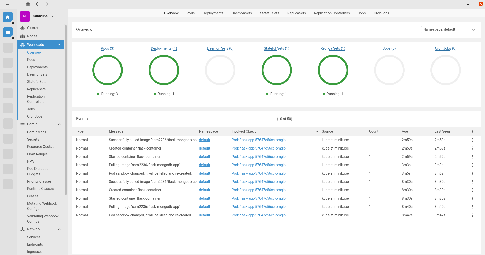
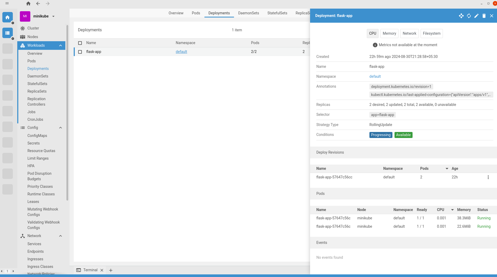
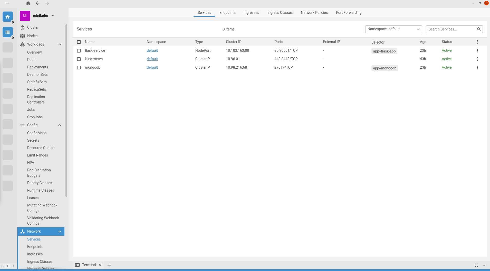
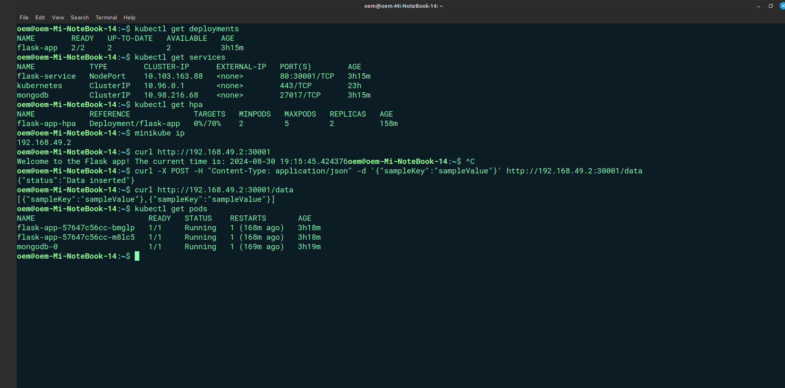
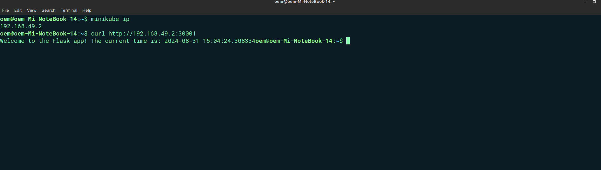
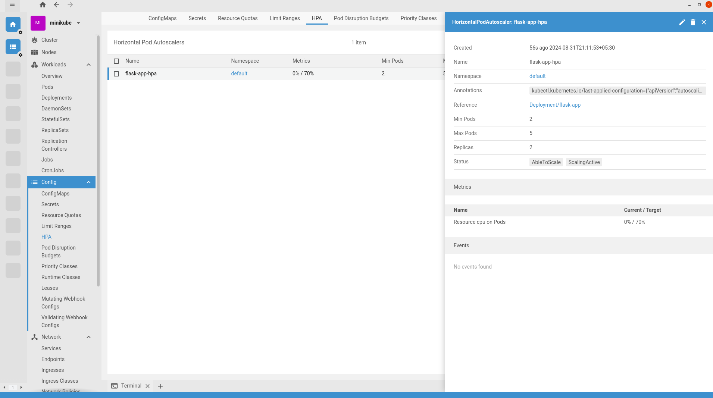
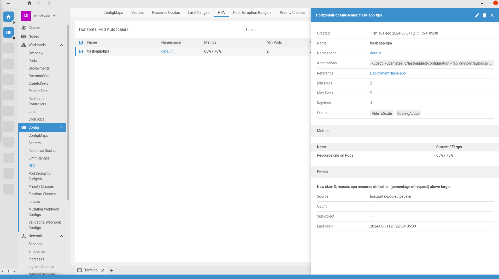
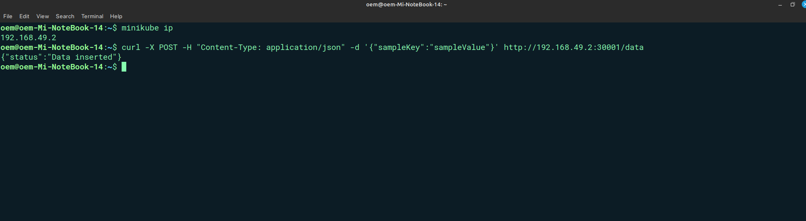

# DevOps Assessment for Buyogo Company

## Prerequisites for Deployment
- Minikube
- Docker
- kubectl

## STEP 1: Build and Push Docker Image
1. **Build the Docker image:**

    ```bash
    docker build -t sam2236/flask-mongodb-app:latest .
    ```
  
2. **Push the Docker image to Docker Hub:**

    ```bash
    docker login
    docker push sam2236/flask-mongodb-app:latest
    ```

## STEP 2: Deploy on Kubernetes
1. **Start Minikube:**

    ```bash
    minikube start
    ```

2. **Apply the Kubernetes resources:**

    ```bash
    kubectl apply -f mongodb-statefulset.yml
    kubectl apply -f mongodb-service.yml
    kubectl apply -f flask-deployment.yml
    kubectl apply -f flask-service.yml
    kubectl apply -f flask-hpa.yml
    ```

3. **Verify the deployments and services:**

    ```bash
    kubectl get deployments
    kubectl get services
    kubectl get statefulsets
    kubectl get hpa
    ```

    The output after deployment is shown below:

    - **Overview of the Cluster:**

      
      
    - **Deployments Output:**

      
      
    - **Services Output:**

      

    - **All Queries Output:**

      

4. **Access the Flask application:**

    To get the IP address of the Minikube cluster, run the following command:

    ```bash
    minikube ip
    ```

    Then, use the obtained IP address to construct the URL,`http://192.168.49.2:30001`, and visit it in my browser as well http api call via server command line.

    

## DNS Resolution in Kubernetes
Each service is assigned a DNS name (e.g., `mongodb-service`) that pods use to communicate with each other. The Flask application connects to MongoDB using the service name, ensuring it resolves to the correct pod.

## Resource Requests and Limits
Resource requests specify the minimum resources required for a container to run, while limits set the maximum resources a container can use. This ensures efficient resource utilization and stability:

- **Requests:** `memory: "256Mi"`, `cpu: "200m"`
- **Limits:** `memory: "512Mi"`, `cpu: "500m"`

## Design Choices
- **Dockerfile:** A slim Python base image was used to reduce the image size. The application runs in production mode by default for security.
- **StatefulSet for MongoDB:** Ensures data persistence and allows for database scaling.
- **Horizontal Pod Autoscaler:** Scales the Flask application based on CPU utilization to handle varying loads efficiently.

## Testing Scenarios
1. **Autoscaling:**

   - In idle state, the application was using 2 replicas.

     

   - Simulate high CPU usage by generating load on the Flask application using the following command in my terminal:

     ```bash
     while true; do curl -s http://192.168.49.2:30001/ > /dev/null; done
     ```

   - Observe that the HPA scales the number of replicas. It was verified that the application scaled from 2 to 3 replicas as CPU utilization exceeded 70%.

     

2. **Database Interactions:** 

   - Perform POST requests to the `/data` endpoint and verify data insertion and retrieval using GET requests. Ensure MongoDB handles the load efficiently.

     

### Results and Issues

- **Database Interactions:** Confirmed successful data insertion and retrieval. No significant issues were encountered, but performance was monitored under load.
